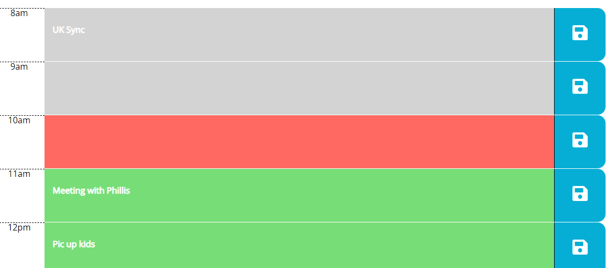

# work_day_scheduler

The following project was conducted to create a calendar application that allows a user to save events for each hour of the day. This app will run in the browser and feature dynamically updated HTML and CSS powered by jQuery.

<H2>Author</H2>
Nick Ross

<H2>Functionality</H2>

The calendar automatically updates the colors of the description depending on the current time. Grey is in the past, red is present, and green is future. This is all done using momentjs.

New Text can be added in the time slots and can be saved which is then added to local storage.

If a user refreshes a page, all data is rendered from local storage in the apporpriate time slots

